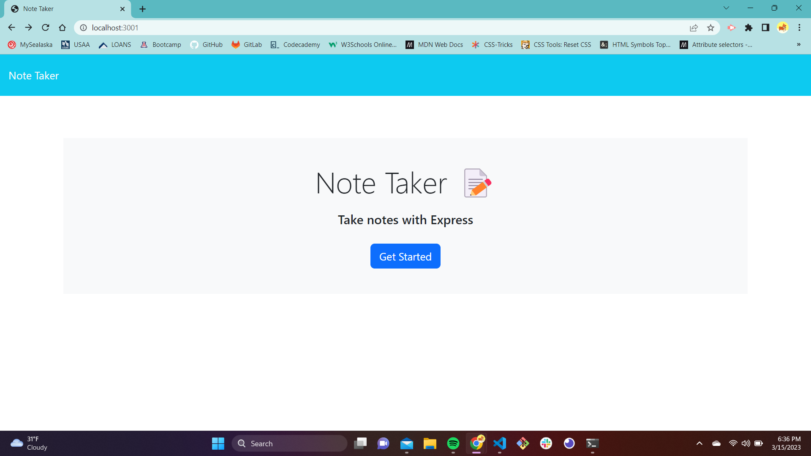
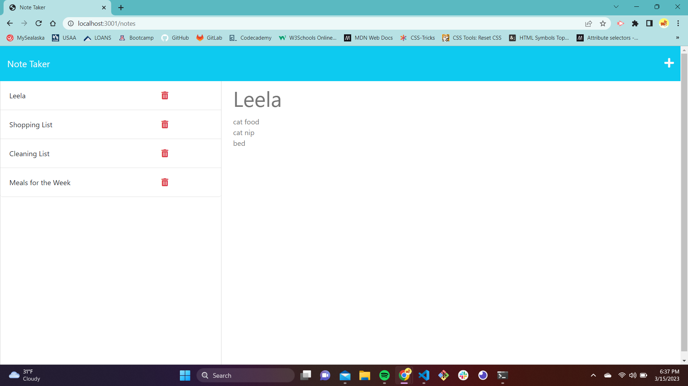

# Note Taker
In this application you will be able to post and delete notes you have created. You will be using an Express.js back end and will save and retrieve note data from a JSON file.

[View Deployed](https://murmuring-fjord-94889.herokuapp.com/)
## Table of Contents

1. [Technology Used](#technology-used)
2. [Installations](#installations)
3. [Preview](#preview)
4. [Questions](#questions)

## Technology Used
1. Express.js
2. Node.js

## Installations
To install Express

```bash
node i 
```

## Preview
Homepage


Note Page


## Questions 
GitHub: [Karina-June](https://github.com/Karina-June)
Email: karinamorrison1@gmail.com